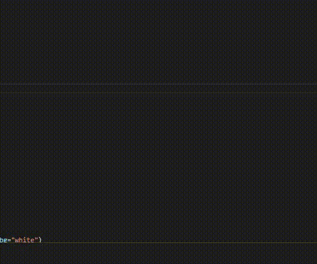
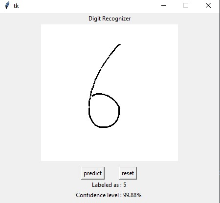
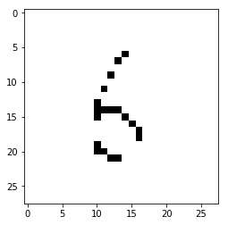

# digit-recognition
"Hello World" of neural networks, implementation of a NeuralNetwork from scratch to classify digits(0-9) using the [MNIST](http://yann.lecun.com/exdb/mnist/) dataset. I also made a GUI to make it more interactive.

digit recognizer - Hello World.ipynb loads the MNIST dataset, builds a NN from scratch and saves weights-biases to various files so this NN can be reconstructed in the app.py

app.py reconstructs the NN, displays an interactive GUI.

layers : 784x128x128x128x10
hidden layers uses "relu" as an activation function
output layer uses softmax activation function.
loss gets calculated with categorical cross entropy loss.

weights and biases initializes randomly

weights = 0.01 * np.random.rand(self.layers[i], self.layers[i + 1])

biases = 0.01 * np.random.rand(self.layers[i + 1])

learning rate = 0.01, epochs = 10

accuracy is around 97%

<b>demo</b>

<h4><b>The application itself is not working accurately.</b></h4>
The reason is that, while converting the drawn image (in canvas) to a 28x28 numpy array, most of the data gets lost. 

|  | 
|:--:| 
| *user's drawing* |

|  | 
|:--:| 
| *resulted image after converting canvas to 28x28* |

Thus, the neural network itself is working with 97% accuracy, however my application is not perfect :(

 
 
That's all, thxxxx

